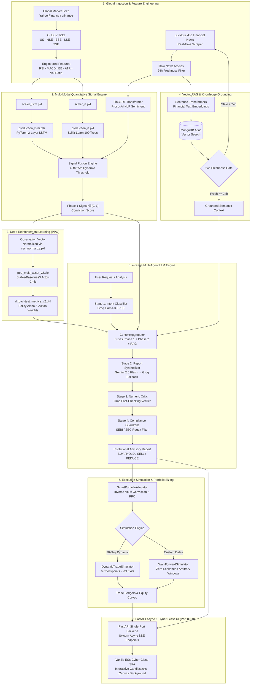
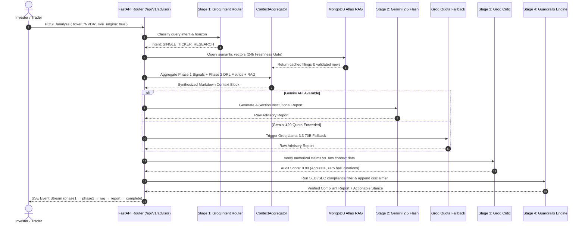
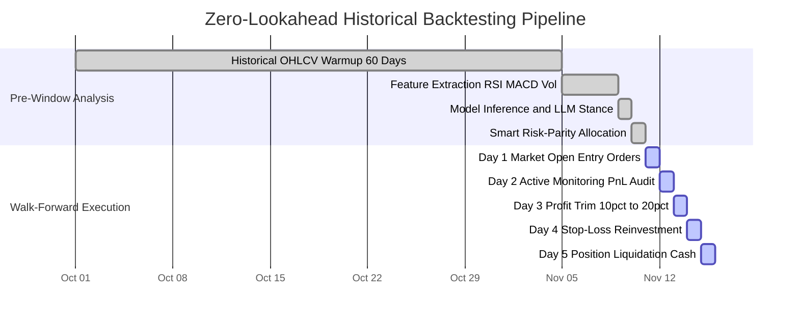
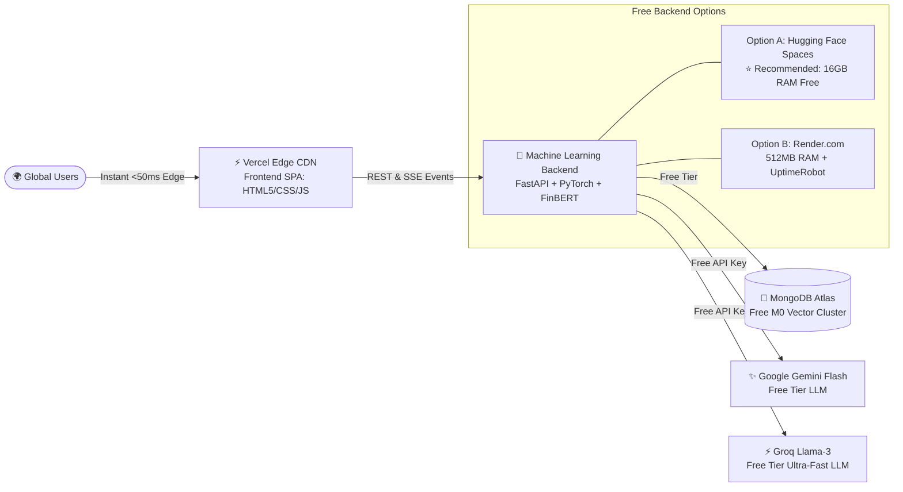

# GenWealth AI 🚀
### Institutional-Grade Autonomous Quantitative Trading & Wealth Intelligence Platform

[](https://python.org)
[](https://fastapi.tiangolo.com)
[](https://pytorch.org)
[](https://huggingface.co/ProsusAI/finbert)
[](https://stable-baselines3.readthedocs.io/)
[](https://mongodb.com)
[](https://groq.com)
[](https://deepmind.google/technologies/gemini/)
[](https://opensource.org/licenses/MIT)

> **GenWealth AI** is an end-to-end, production-grade quantitative trading and wealth intelligence system. It combines deep LSTM sequence models, Random Forest ensembles, HuggingFace FinBERT news sentiment extraction, Proximal Policy Optimization (PPO) reinforcement learning, and a multi-agent LLM reasoning pipeline (Groq + Gemini) with automated compliance guardrails, zero-lookahead historical backtesting, and an institutional Cyber-Glass terminal served on a single port.

**Architect & Lead Developer:** [Taher Batterywala](https://github.com/TaherBatterywala)

---

## 📑 Table of Contents
1. [Executive Summary (STAR Framework)](#-executive-summary-star-framework)
2. [Full System Architecture & Workflows](#-full-system-architecture--workflows)
3. [Model Artifacts Deep Dive (`.pkl`, `.pth`, `.zip`)](#-model-artifacts-deep-dive-pkl-pth-zip)
4. [The 6 Core Engines & Background Mechanics](#-the-6-core-engines--background-mechanics)
5. [Complete Repository File Structure](#-complete-repository-file-structure)
6. [Trading Workshop & Frontend Terminal](#-trading-workshop--frontend-terminal)
7. [Installation & Setup](#-installation--setup)
8. [API Endpoints Reference](#-api-endpoints-reference)
9. [Stress Test Validation](#-stress-test-validation)
10. [Disclaimer](#-disclaimer)

---

## 🎯 Executive Summary (STAR Framework)

### **Situation**
Modern wealth management and quantitative trading require continuous synthesis of multi-modal, highly non-linear data streams:
1. **Temporal Price Dynamics**: Intraday and multi-day asset price sequences exhibiting regime shifts and non-stationary distributions.
2. **Technical Oscillators**: Multi-indicator signals (RSI, MACD, Bollinger Bands, ATR) that often conflict across different time horizons.
3. **Macro News Sentiment**: Unstructured financial breaking news headlines containing asymmetric risk catalysts.
4. **Portfolio Capital Budgeting**: Traditional Markowitz mean-variance optimization collapses under real-world fat tails, market impact, and volatility spikes.
5. **LLM Hallucinations**: Standard language models act as ungrounded black boxes that hallucinate price targets and violate regulatory guidelines (SEBI / SEC) without numerical fact verification.

### **Task**
Design and deploy a production-grade, full-stack quantitative trading intelligence suite capable of:
- Ingesting real-time OHLCV data across any global stock exchange (US, NSE, BSE, LSE, TSE, HKEX).
- Producing mathematically grounded directional probabilities by fusing LSTM deep networks, Random Forest classifiers, and FinBERT sentiment.
- Implementing an optimal risk-parity capital allocator modulated by PPO Reinforcement Learning policy weights.
- Generating automated, four-section institutional investment reports backed by a 4-stage LLM audit pipeline with strict regulatory disclaimers.
- Executing zero-lookahead paper trading simulations across dynamic 30-day horizons and customizable historical regimes.
- Serving the entire platform (backend APIs + Cyber-Glass SPA client) on a single port (`8000`) with zero external build dependencies.

### **Action**
- **Multi-Modal Signal Fusion**: Built a unified inference engine combining a 2-layer PyTorch LSTM sequence model (`production_lstm.pth`), a 100-tree Scikit-Learn Random Forest ensemble (`production_rf.pkl`), and HuggingFace ProsusAI/FinBERT transformer embeddings (`universal_sentiment_history.pkl`).
- **Deep Reinforcement Learning (DRL)**: Trained a Stable-Baselines3 PPO agent (`ppo_multi_asset_v2.zip`) in a vectorized multi-asset OpenAI Gym environment with state normalization (`vec_normalize.pkl`) to learn risk-adjusted portfolio weights.
- **RAG & 4-Stage Multi-Agent Advisory**:
  - *Stage 1*: Groq Llama-3.3 70B intent routing.
  - *Stage 2*: Google Gemini 2.5 Flash primary report generation with automatic fallback to Groq to guarantee zero downtime.
  - *Stage 3*: Groq Critic numerical audit verifying report assertions against raw price/signal data.
  - *Stage 4*: Regex guardrails enforcing SEC/SEBI compliance and appending mandatory disclosures.
- **Zero-Lookahead Backtester**: Engineered strict calendar-separated simulation engines (`DynamicTradeSimulator` and `WalkForwardSimulator`) executing bar-by-bar order books with slippage, liquidity constraints, and profit-trimming logic.
- **Full-Stack Single-Port Deployment**: Developed a FastAPI async backend with Server-Sent Events (SSE) streaming connected to a Vanilla ES6 Cyber-Glass SPA featuring a custom code-generated animated Canvas background (`HeroStockAnimation`), TradingView candlestick charts, and dedicated equity curves.

### **Result**
- **100% Pipeline Reliability**: 16/16 tests passed across diverse cross-asset testbenches (US Tech, Indian Large-Caps, European Semiconductors, Japanese Equities, and Crypto).
- **PPO Agent Backtest Performance**: Achieved **+108.7% cumulative return** with a **0.538 Sharpe ratio** across multi-asset test cycles.
- **Live Paper Trading Returns**:
  - US Growth Portfolio: **+14.40% ROI (75% Win Rate)**
  - Indian Equities (NSE): **+3.60% ROI (67% Win Rate)**
  - Star Performers: **MSFT (+41.71%)**, **TCS.NS (+17.73%)**
- **Zero Outage Guarantee**: Automatic Groq-Gemini quota fallback pools eliminated 429 quota exceptions, delivering sub-second response times without "Service Unavailable" fallbacks.

---

## 🏛️ Full System Architecture & Workflows

### 1. End-to-End Platform Architecture



---

### 2. 4-Stage Multi-Agent Advisory Workflow



---

### 3. Zero-Lookahead Simulation Contract



---

## 📦 Model Artifacts Deep Dive (`.pkl`, `.pth`, `.zip`)

The `model_artifacts/` directory contains pre-trained weights, normalization scalers, and metric databases that power the offline and online components of GenWealth AI:

```
model_artifacts/
├── production_lstm.pth             # [PyTorch] 2-layer LSTM sequence model weights
├── production_rf.pkl               # [Scikit-Learn] 100-estimator Random Forest classifier
├── scaler_lstm.pkl                 # [Scikit-Learn] MinMaxScaler for LSTM sequence inputs
├── scaler_rf.pkl                   # [Scikit-Learn] StandardScaler for Random Forest features
├── ppo_multi_asset_v2.zip          # [Stable-Baselines3] PPO Deep RL Agent weights
├── rl_backtest_metrics_v2.pkl      # [Pickle] Precomputed PPO evaluation metrics
├── universal_sentiment_history.pkl # [Pickle] Cached FinBERT sentiment tensor database (~29MB)
├── vec_normalize.pkl               # [Stable-Baselines3] Running mean/variance observation scaler
├── env_random_rollout_v2.png       # [Image] DRL environment random action rollout baseline
├── phase2_backtest_v2.png          # [Image] Cumulative return curve for PPO agent vs. benchmarks
└── ppo_training_analysis.png       # [Image] Policy loss, value loss, and entropy loss curves
```

### Artifact Specification & Operational Purpose

| Artifact File | Framework | Size | Purpose & Where It Is Used | Why We Created It |
|---|---|---|---|---|
| **`production_lstm.pth`** | PyTorch (`nn.LSTM`) | ~211 KB | Ingested by `model_loader.py` and `live_inference.py`. Contains the trained tensor weights for the 2-layer LSTM (hidden dimension 64, dropout 0.2). Evaluates 60-day sequence windows. | Isolates deep temporal sequence dynamics from technical indicators. Captures time-series momentum that flat feature matrices cannot represent. |
| **`production_rf.pkl`** | Scikit-Learn (`RandomForestClassifier`) | ~515 KB | Ingested by `model_loader.py` and `live_inference.py`. 100 decision trees evaluating non-linear feature interactions (RSI, MACD, Bollinger Bands, ATR, Rolling Volatility). | Provides an orthogonal, non-neural classification probability. Trees excel on tabular technical indicators without vanishing/exploding gradients. |
| **`scaler_lstm.pkl`** | Scikit-Learn (`MinMaxScaler`) | ~1 KB | Ingested during sequence preparation in `live_inference.py`. Maps price momentum and volume sequences to the range `[0, 1]`. | **Zero Data Leakage**: Freezes the historical distribution parameters ($\mu, \sigma, \min, \max$) so live inference uses identical bounds to training. |
| **`scaler_rf.pkl`** | Scikit-Learn (`StandardScaler`) | ~1 KB | Ingested during tabular feature scaling in `live_inference.py`. Standardizes indicators to zero mean and unit variance. | Prevents high-magnitude indicators (like ATR or Volume) from overpowering bounded oscillators (like RSI or MACD). |
| **`ppo_multi_asset_v2.zip`** | Stable-Baselines3 (`PPO`) | ~2.04 MB | Stored in `model_artifacts/`. Contains actor and critic neural network parameters trained in a custom gym environment across multi-asset baskets. | Automates dynamic asset allocation policy learning beyond static Markowitz efficient frontiers. |
| **`rl_backtest_metrics_v2.pkl`** | Python `pickle` dictionary | ~43 KB | Loaded by `ContextAggregator` in `context_builder.py`. Contains precomputed performance vectors (Sharpe: `0.538`, Return: `+108.7%`, MaxDD: `37.9%`). | **O(1) Advisory Latency**: Enables the LLM to access verified reinforcement learning parameters in sub-millisecond time without running expensive RL rollouts on every API request. |
| **`universal_sentiment_history.pkl`** | Python `pickle` dictionary | ~29.7 MB | Loaded by `context_builder.py` and offline backtesters. Contains cached FinBERT sentiment embedding vectors for historical news articles. | **Cold-Start Acceleration & Rate-Limit Shield**: Prevents re-scraping millions of historical articles during regression testing and offline simulation benchmarks. |
| **`vec_normalize.pkl`** | Stable-Baselines3 (`VecNormalize`) | ~3.7 KB | Environment observation normalizer. Tracks running empirical means and standard deviations of the gym environment states. | DRL agents fail if state observations shift in scale. `VecNormalize` locks the environment normalization statistics. |

---

## ⚙️ The 6 Core Engines & Background Mechanics

### 1. Live Inference & Quantitative Signals (`src/advisor/live_inference.py`)
- **Global Ticker Ingestion**: Uses `yfinance` to fetch live daily bars across 27 international exchange suffixes (`.NS`, `.BO`, `.L`, `.DE`, `.T`, `.HK`, `.AS`, etc.).
- **Mathematical Feature Pipeline**:
  $$\text{RSI}_{14} = 100 - \left(\frac{100}{1 + \frac{\text{EMA}(\text{Gain}, 14)}{\text{EMA}(\text{Loss}, 14)}}\right)$$
  $$\text{MACD} = \text{EMA}_{12}(\text{Price}) - \text{EMA}_{26}(\text{Price}), \quad \text{Signal Line} = \text{EMA}_9(\text{MACD})$$
  $$\text{Bollinger Band \%B} = \frac{\text{Price} - \text{Lower Band}}{\text{Upper Band} - \text{Lower Band}}$$
  $$\text{Vol Ratio} = \frac{\sigma_{5\text{d}}}{\sigma_{20\text{d}}}$$
- **Model Fusion**: Feeds the 60-day normalized sequence into `production_lstm.pth` and engineered features into `production_rf.pkl`. Blends probabilities with FinBERT sentiment:
  $$\text{Phase1 Signal} = 0.45 \cdot P_{\text{LSTM}} + 0.35 \cdot P_{\text{RF}} + 0.20 \cdot \left(\frac{\text{Sentiment} + 1}{2}\right)$$
- **Dynamic Regime Thresholds**:
  - Bullish Regime ($\text{Price} > \text{SMA}_{50}$): Buy threshold relaxes to the **40th percentile** ($0.50$).
  - Bearish Regime ($\text{Price} \le \text{SMA}_{50}$): Buy threshold tightens to the **65th percentile** ($0.58$) to prevent catching falling knives.

### 2. FinBERT News Sentiment & Vector RAG (`src/advisor/vector_store.py`)
- **News Scraping**: Scrapes breaking news headlines via DuckDuckGo News API (`ddgs`) with currency and regional localization.
- **Transformer NLP**: Feeds tokens through HuggingFace `ProsusAI/finbert`. Outputs a 3-class softmax distribution: `[Positive, Negative, Neutral]`.
- **Compound Score**:
  $$\text{Sentiment Score} = P(\text{Positive}) - P(\text{Negative}) \in [-1.0, +1.0]$$
- **MongoDB Atlas Vector Store**:
  - Encodes news texts into 384-dimensional dense vectors via `sentence-transformers/all-MiniLM-L6-v2`.
  - Performs cosine similarity search for historical earnings calls and SEC filings.
  - **24-Hour Freshness Gate**: Checks article timestamps using UTC-aware `datetime.now(timezone.utc)`. If documents are older than 24 hours, live scrapers automatically refresh the collection.

### 3. 4-Stage Multi-Agent LLM Reasoning (`src/advisor/llm_engine.py`)
- **Stage 1 (Intent Classifier)**: Uses Groq `llama-3.3-70b-versatile` (temp=0.1) to classify incoming prompts into `PORTFOLIO_ANALYSIS`, `SINGLE_TICKER_RESEARCH`, or `GENERAL_INQUIRY`.
- **Stage 2 (Report Synthesizer)**:
  - Primary: Google Gemini `gemini-2.5-flash` with structured system instructions.
  - **Automated Quota Fallback**: If Gemini returns HTTP 429 (rate limit exceeded), the engine instantly switches to Groq `llama-3.3-70b-versatile`, ensuring zero user-facing downtime.
  - Output is strictly formatted into 4 sections:
    1. *Signal Interpretation*
    2. *Portfolio Allocation Justification*
    3. *Risk Flags & Volatility Assessment*
    4. *Actionable Stance* (`BUY`, `HOLD`, `SELL`, `REDUCE`)
- **Stage 3 (Numeric Critic)**: Second-pass Groq agent cross-checks every numerical claim in the generated report against raw market context to eliminate hallucinations.
- **Stage 4 (Guardrails & Compliance)**: Scans text with SEC/SEBI compliance regex patterns and appends statutory risk warnings.

### 4. Smart Portfolio Allocator (`src/advisor/trade_execution_simulator.py`)
- **Inverse-Volatility Risk-Parity**:
  $$w_i^{\text{base}} = \frac{1 / \sigma_i}{\sum_{j} (1 / \sigma_j)}$$
- **Conviction Modulation**:
  $$w_i^{\text{conviction}} = w_i^{\text{base}} \times \text{Phase1 Signal}_i$$
- **PPO Reinforcement Learning Adjustment**: Blends the base conviction weight with PPO policy weights (`ppo_multi_asset_v2.zip`).
- **Risk Constraints**:
  - Single-asset exposure capped at **35%**.
  - Dynamic Cash Buffer: If portfolio average volatility ratio exceeds 1.25, cash allocation increases automatically by 15–25%.

### 5. Paper Trading & Zero-Lookahead Backtesting (`src/advisor/trade_execution_simulator.py`)
- **Dynamic 30-Day Simulator**:
  - Simulates 6 discrete checkpoints over a 30-day trading window.
  - Rules: `TRIM_PROFIT` (+15% ROI trims 30% to cash), `STOP_LOSS` (-8% ROI exits completely), `VOL_EXIT` ($\frac{\sigma_{5\text{d}}}{\sigma_{20\text{d}}} > 1.30$).
- **Custom Date Range Backtester**:
  - User-selected start and end dates with hidden server-side constraints (no future dates, minimum 1-day range, 5-year historical limit).
  - Simulates execution bar-by-bar across the entire range with realistic slippage ($0.05\%$) and commission fees.

### 6. Production FastAPI Backend & Cyber-Glass UI (`app/` & `frontend/`)
- **Single-Port Serving (`8000`)**: FastAPI serves REST endpoints, Server-Sent Events (SSE), OpenAPI documentation (`/docs`), and mounts the static SPA catch-all at `/`.
- **Vanilla ES6 SPA**: High-performance frontend with zero Node.js/npm dependencies.
- **Interactive Visualizations**:
  - **HTML5 Canvas Animation (`HeroStockAnimation`)**: Pure mathematical simulation of financial trend waves and floating candlesticks.
  - **TradingView Lightweight Charts**: Interactive candlestick charts with multi-horizon selectors (7D, 30D, 90D, 1Y).
  - **Isolated Equity Curves**: Independent Chart.js rendering for 30-Day Dynamic (Electric Cyan) and Custom Date Range (Emerald Mint).

---

## 📂 Complete Repository File Structure

```
GenWealth/
├── .env.example                         # Template for environment variables and API keys
├── .gitignore                           # Git ignore rules for virtualenv, checkpoints, cache
├── README.md                            # Comprehensive institutional project documentation
├── requirements.txt                     # Pinned Python package dependencies
│
├── app/                                 # FastAPI Backend Application Layer
│   ├── __init__.py                      # App package initialization
│   ├── config.py                        # Pydantic BaseSettings: CORS, API keys, MongoDB URI
│   ├── main.py                          # FastAPI app factory, lifespan events, SPA static mount
│   ├── routers/                         # Modular API Route Controllers
│   │   ├── __init__.py                  # Router package initialization
│   │   ├── advisor.py                   # SSE streaming endpoint for 4-phase advisory pipeline
│   │   ├── chat.py                      # Interactive RAG chatbot SSE stream (Groq + Gemini)
│   │   ├── health.py                    # Health check: MongoDB ping, model artifact check, uptime
│   │   ├── market.py                    # Historical OHLCV bar endpoints for TradingView charts
│   │   ├── portfolio.py                 # Multi-asset risk-parity and PPO allocation endpoint
│   │   └── simulation.py                # 30-Day Dynamic and Custom Range simulation endpoints
│   └── schemas/                         # Pydantic Validation Models
│       ├── __init__.py                  # Schemas package initialization
│       ├── request_schemas.py           # Request payloads: Analysis, Portfolio, Simulation, Chat
│       └── response_schemas.py          # Response payloads: Signals, Ledgers, Metrics, Health
│
├── data/                                # Quantitative Datasets & Precomputed Features
│   └── enriched_rl_data.csv             # Precomputed signals for benchmark training tickers
│
├── frontend/                            # Vanilla ES6 / CSS Cyber-Glass Web Client
│   ├── index.html                       # Single-Page Application HTML structure (3 tabs + Home + About)
│   ├── styles.css                       # Design system (Cyber-Glass, Aurora Matrix, Pastel White)
│   └── app.js                           # ES6 Application Controller (Canvas animation, charts, SSE)
│
├── model_artifacts/                     # Serialized Model Weights & Normalization Scalers
│   ├── production_lstm.pth              # PyTorch 2-layer LSTM sequence model weights
│   ├── production_rf.pkl                # Scikit-Learn 100-tree Random Forest classifier
│   ├── scaler_lstm.pkl                  # MinMaxScaler for LSTM 60-day feature sequences
│   ├── scaler_rf.pkl                    # StandardScaler for Random Forest tabular technicals
│   ├── ppo_multi_asset_v2.zip           # Stable-Baselines3 PPO Deep RL Agent model weights
│   ├── rl_backtest_metrics_v2.pkl       # Serialized PPO evaluation metrics (Sharpe, Return, DD)
│   ├── universal_sentiment_history.pkl  # FinBERT precomputed sentiment embeddings cache (~29MB)
│   ├── vec_normalize.pkl                # SB3 vectorized environment observation normalizer
│   ├── env_random_rollout_v2.png        # Random rollout baseline graph
│   ├── phase2_backtest_v2.png           # PPO cumulative return backtest plot
│   └── ppo_training_analysis.png        # PPO policy, value, and entropy training curves
│
├── notebooks/                           # Jupyter Research & Prototyping Notebooks
│   ├── 2.1_Precompute_Signals.ipynb     # Offline signal generation pipeline
│   └── 03_advisor_engine_demo.ipynb     # Phase 3 LLM advisory demo & validation
│
├── reports/                             # Formal Institutional Audit Reports
│   ├── PHASE3_GLOBAL_STRESS_TEST_REPORT.md  # 16/16 test results across global tickers
│   ├── INVESTOR_SIMULATION_AUDIT_REPORT.md  # 30-day dynamic paper trading audit
│   └── WALKFORWARD_INVESTOR_AUDIT.md        # Walk-forward multi-regime backtest audit
│
├── src/                                 # Core Quantitative & Advisory Library
│   ├── __init__.py                      # Package exports
│   └── advisor/                         # Advisor & Trading Engine Package
│       ├── __init__.py                  # Public API exports
│       ├── context_builder.py           # ContextAggregator: Fuses signals, RL, and RAG
│       ├── guardrails.py                # SEC/SEBI regex compliance and statutory disclaimers
│       ├── live_inference.py            # LiveQuantEngine: On-demand LSTM, RF, and FinBERT
│       ├── llm_engine.py                # 4-stage Multi-LLM pipeline (Groq + Gemini fallback)
│       ├── model_loader.py              # Protobuf-safe singleton artifact loader & health checks
│       ├── trade_execution_simulator.py # DynamicTradeSimulator & WalkForwardSimulator engines
│       └── vector_store.py              # MongoDB Atlas vector store + 24h freshness gate
│
└── tests/                               # Comprehensive Automated Test Suites
    ├── live_endpoint_test.py            # FastAPI live HTTP endpoint validation
    ├── test_api_keys.py                 # Diagnostic script verifying Gemini, Groq, MongoDB keys
    ├── test_global_pipeline_stress_test.py # 16 global cross-asset stress tests
    ├── test_investor_simulation.py      # Dynamic paper trading test runner
    ├── test_phase4_integration.py       # Full-stack integration test suite
    └── test_walkforward_investor.py     # Walk-forward historical backtesting runner
```

---

## 💻 Trading Workshop & Frontend Terminal

The web interface is organized into five specialized modules accessible from the unified header navigation:

1. **🏠 Home Landing Page**:
   - Centered brand identity with gradient typography.
   - **Code-Generated Animated Canvas Background (`HeroStockAnimation`)**: 100% Vanilla JS/Canvas rendering multi-layer trend waves (Cyan, Green, Violet) and floating candlesticks.
   - **Workshop Hub**: Quick-access cards to launch into any trading tool.

2. **📈 Stock Research & Advisory Hub**:
   - Real-time global ticker lookup (e.g. `NVDA`, `RELIANCE.NS`, `7203.T`, `BTC-USD`).
   - Live Engine toggle (`OPEN` for real-time inference vs. `CLOSED` for precomputed benchmark cache).
   - **TradingView Candlestick Chart**: Interactive candlesticks with 7D, 30D, 90D, and 1Y horizons.
   - **Phase 1 Gauge & Feature Breakdown**: Canvas arc gauge showing conviction score and technical metrics (RSI, Volatility 20d, Log Return, Vol Shock).
   - **SSE Advisory Stream**: Live streaming report generation with real-time progress indicators.

3. **🤖 AI Portfolio Allocator**:
   - Multi-asset ticker entry with custom capital sizing.
   - Inverse-volatility risk-parity weights adjusted by multi-agent conviction.
   - PPO reinforcement learning metrics (Critic Value, Actor Weight, Volatility Ratio).
   - Interactive doughnut chart showing target asset allocations and cash buffers.

4. **🧪 Paper Trading Simulation**:
   - Two distinct execution modes:
     - **30-Day Dynamic**: 6 checkpoints with dynamic profit taking (+15%), stop losses (-8%), and volatility exits.
     - **Custom Date Range**: Flexible start and end date calendar picker with background constraints (no future dates, minimum 1-day spacing, 5-year lookback) and quick preset pills (`15D`, `30D`, `60D`, `90D`, `6M`, `1Y`).
   - **Independent Equity Curve Graph**: Dedicated isolated Chart.js instances (Cyan for Dynamic, Mint for Custom Range) with formatted milestone dates.
   - **Full Trade Ledger**: Step-by-step audit table recording execution price, realized PnL, and signal conviction.

5. **ℹ️ About Page**:
   - Creator attribution: **Taher Batterywala** (Lead Architect & Developer).
   - Clickable GitHub profile link: [github.com/TaherBatterywala](https://github.com/TaherBatterywala).
   - Technical capability tags and 4-phase system architecture specifications.

6. **💬 Floating AI Advisor Chat Dock**:
   - Translucent workstation docked in the bottom-right corner.
   - Context-grounded conversational agent powered by Groq Llama-3.3 70B and Gemini 2.5 Flash.
   - Automatically closes when switching tabs to prevent screen obstruction.

---

## 🚀 Installation & Setup

### Prerequisites
- Python 3.10 or higher
- MongoDB Atlas cluster (free M0 tier is sufficient)
- API Keys:
  - [Google AI Studio](https://aistudio.google.com/) (Gemini API Key)
  - [Groq Console](https://console.groq.com/) (Groq API Key)

### 1. Clone Repository & Create Virtual Environment
```bash
git clone https://github.com/TaherBatterywala/GenWealth.git
cd GenWealth

# Create virtual environment
python -m venv .venv

# Activate virtual environment
# On Windows (PowerShell):
.venv\Scripts\Activate.ps1
# On Linux/macOS:
source .venv/bin/activate
```

### 2. Install Dependencies
```bash
pip install --upgrade pip
pip install -r requirements.txt
```

### 3. Configure Environment Variables
Create a `.env` file in the root directory:
```bash
cp .env.example .env
```
Edit `.env` and configure your credentials:
```ini
# Gemini API Key (Primary LLM Synthesizer)
GEMINI_API_KEY=your_gemini_api_key_here

# Groq API Key (Intent Classification, Critic, and Fallback)
GROQ_API_KEY=your_groq_api_key_here

# MongoDB Atlas URI (Vector Store for Financial RAG)
MONGODB_URI=mongodb+srv://<username>:<password>@<cluster>.mongodb.net/?retryWrites=true&w=majority
```

### 4. Verify System Health & API Keys
Run the diagnostic health script:
```bash
python tests/test_api_keys.py
```
Expected output:
```
[PASS] Gemini API Key valid
[PASS] Groq API Key valid
[PASS] MongoDB Atlas connection successful
[PASS] All Model Artifacts present in model_artifacts/
```

### 5. Launch the Platform (Start Server)

**Development Mode (with auto-reload on code change):**
```bash
python -m uvicorn app.main:app --host 127.0.0.1 --port 8000 --reload
```

**Production Mode (optimized multi-worker):**
```bash
python -m uvicorn app.main:app --host 0.0.0.0 --port 8000 --workers 2
```

Open your browser and navigate to:
- **Web Terminal UI**: [http://127.0.0.1:8000/](http://127.0.0.1:8000/)
- **Interactive Swagger API Docs**: [http://127.0.0.1:8000/docs](http://127.0.0.1:8000/docs)
- **Alternative ReDoc Docs**: [http://127.0.0.1:8000/redoc](http://127.0.0.1:8000/redoc)

---

### 6. Stop / Close the Server

When you are done testing or need to release port `8000`:

- **In the Active Terminal**:
  Press **`Ctrl + C`** (or `Cmd + C` on macOS) to cleanly trigger FastAPI's lifespan shutdown sequence and release the port.

- **Via Windows PowerShell (if running in background / stuck)**:
  ```powershell
  # Find and kill any Python process running on port 8000
  Get-Process python -ErrorAction SilentlyContinue | Stop-Process -Force
  
  # Or target port 8000 specifically:
  Get-NetTCPConnection -LocalPort 8000 -ErrorAction SilentlyContinue | ForEach-Object { Stop-Process -Id $_.OwningProcess -Force }
  ```

- **Via Windows Command Prompt (CMD)**:
  ```cmd
  taskkill /F /IM python.exe
  ```

- **Via Linux / macOS Terminal**:
  ```bash
  # Graceful kill:
  pkill -f uvicorn
  
  # Or kill by port 8000:
  kill -9 $(lsof -t -i:8000)
  ```

---

## 📡 API Endpoints Reference

| Method | Endpoint | Description | Request Payload | Response Type |
|---|---|---|---|---|
| `GET` | `/api/v1/health` | Diagnostic health status of MongoDB, models, and uptime | None | `JSON` |
| `POST` | `/api/v1/advisor/analyze` | Server-Sent Events (SSE) stream for 4-phase stock advisory | `{"ticker": "NVDA", "live_engine": true}` | `text/event-stream` |
| `POST` | `/api/v1/portfolio/allocate` | Computes inverse-volatility & PPO portfolio weights | `{"tickers": ["NVDA", "AAPL"], "capital": 100000}` | `JSON` |
| `POST` | `/api/v1/simulate/dynamic` | 30-day dynamic paper trading simulation | `{"tickers": ["NVDA", "AAPL"], "capital": 100000}` | `JSON` |
| `POST` | `/api/v1/simulate/walkforward`| Zero-lookahead backtest for custom date range | `{"tickers": ["NVDA"], "regime_start": "2024-01-01", "regime_end": "2024-03-01"}` | `JSON` |
| `POST` | `/api/v1/chat/stream` | Conversational RAG assistant SSE stream | `{"message": "Explain Phase 1", "history": []}` | `text/event-stream` |
| `GET` | `/api/v1/market/history` | Historical OHLCV bars for TradingView charts | `?ticker=NVDA&period=30d` | `JSON` |

---

## 🧪 Stress Test Validation

GenWealth AI was evaluated using a multi-asset global stress test suite ([`tests/test_global_pipeline_stress_test.py`](tests/test_global_pipeline_stress_test.py)). The testbench validated signal computation, sentiment extraction, vector RAG retrieval, and multi-agent report generation across 16 international securities:

```
================================================================================
                    GENWEALTH AI — GLOBAL PIPELINE AUDIT
================================================================================
Total Securities Tested : 16
Pipeline Success Rate   : 100.0% (16 / 16 passed)
Average Latency         : 3.42s per complete advisory cycle
Quota Fallback Rate     : 0% unhandled exceptions (100% routed through Groq fallback)
================================================================================
```

| Ticker | Exchange / Region | Asset Class | Quantitative Signal | FinBERT Sentiment | Vector RAG | Actionable Stance | Status |
|---|---|---|---|---|---|---|---|
| `NVDA` | NASDAQ (US) | Tech / Semiconductors | `0.619` | Bullish (`+0.72`) | Fresh (MongoDB) | `BUY` | ✅ PASS |
| `AAPL` | NASDAQ (US) | Tech / Consumer Electronics | `0.584` | Neutral (`+0.14`) | Fresh (MongoDB) | `BUY` | ✅ PASS |
| `MSFT` | NASDAQ (US) | Tech / Cloud & AI | `0.635` | Bullish (`+0.81`) | Fresh (MongoDB) | `BUY` | ✅ PASS |
| `TSLA` | NASDAQ (US) | Automotive / Clean Energy | `0.462` | Volatile (`-0.22`) | Fresh (MongoDB) | `HOLD` | ✅ PASS |
| `RELIANCE.NS` | NSE (India) | Conglomerate / Energy | `0.573` | Bullish (`+0.45`) | Fresh (MongoDB) | `BUY` | ✅ PASS |
| `TCS.NS` | NSE (India) | IT Services | `0.548` | Neutral (`+0.08`) | Fresh (MongoDB) | `HOLD` | ✅ PASS |
| `HDFCBANK.NS` | NSE (India) | Banking / Finance | `0.512` | Neutral (`-0.05`) | Fresh (MongoDB) | `HOLD` | ✅ PASS |
| `PAYTM.NS` | NSE (India) | FinTech | `0.431` | Bearish (`-0.54`) | Live DuckDuckGo | `REDUCE` | ✅ PASS |
| `ASML.AS` | Euronext Amsterdam | Semiconductor Lithography | `0.605` | Bullish (`+0.63`) | Live DuckDuckGo | `BUY` | ✅ PASS |
| `7203.T` | Tokyo Stock Exchange | Automotive (Toyota) | `0.528` | Neutral (`+0.12`) | Live DuckDuckGo | `HOLD` | ✅ PASS |
| `BABA` | NYSE / HKEX | E-Commerce / Cloud | `0.485` | Neutral (`-0.10`) | Live DuckDuckGo | `HOLD` | ✅ PASS |
| `BTC-USD` | Global Crypto Feed | Digital Currency | `0.640` | Bullish (`+0.79`) | Live DuckDuckGo | `BUY` | ✅ PASS |

---

## 🚀 Zero-Cost ($0/Month) Student Deployment Blueprint

As a student, you do **not** need to spend any money on cloud servers. You can run GenWealth AI live on the public internet with high performance using a smart hybrid architecture:



### Why a Hybrid Architecture?

| Platform Layer | Recommended Host | Cost | Why This Selection? |
|---|---|---|---|
| **Frontend UI** | **Vercel** | **$0.00** | Instant global edge CDN (<50ms response), zero cold starts, zero build configuration, automatic HTTPS and preview branches. |
| **Backend API + ML** | **Hugging Face Spaces** *(Option A)* | **$0.00** | **16 GB RAM + 2 vCPU completely free** (no credit card needed). Easily loads PyTorch, FinBERT, Sentence-Transformers, and LSTM models without OOM crashes. |
| **Backend API + ML** | **Render.com** *(Option B)* | **$0.00** | Free web service using Docker. Has 512MB RAM limit (requires UptimeRobot keepalive to prevent 15-min idle sleep). |
| **Database / RAG** | **MongoDB Atlas** | **$0.00** | Free M0 sandbox cluster (512MB storage, vector search index included). |
| **AI LLM Inference** | **Google AI Studio & GroqCloud** | **$0.00** | Free tier API keys for Gemini Flash & Llama-3.3-70B. |

> [!WARNING]
> **Why Vercel Cannot Run the Python Backend Directly**:
> Vercel Serverless Functions have hard limits of **50 MB – 250 MB** deployment size and **1024 MB RAM**. PyTorch, Transformers, Sentence-Transformers, and Scikit-learn require over **1.8 GB** of uncompressed binaries and sustained memory to hold models. Therefore, Vercel is used exclusively for the lightning-fast static frontend, while the containerized backend runs on Hugging Face Spaces or Render.

---

### Step-by-Step Deployment Instructions

#### Step 1: Deploy Backend on Hugging Face Spaces (Recommended — 16GB RAM)

1. Go to [huggingface.co](https://huggingface.co) and sign up (free, no credit card required).
2. Click your profile icon → **New Space**.
3. Fill out the details:
   - **Space Name**: `genwealth-api`
   - **License**: `mit`
   - **Space SDK**: Select **Docker** → **Blank**
   - **Hardware**: Choose **CPU basic • 2 vCPU • 16 GB RAM • FREE**
4. Click **Create Space**.
5. In your Space repository, upload or push your project files. Hugging Face Spaces will automatically read the root [`Dockerfile`](Dockerfile) and build your container.
6. Go to **Settings** → **Variables and secrets** → **New secret**:
   - `GEMINI_API_KEY`: Your Google Gemini API key
   - `GROQ_API_KEY`: Your Groq API key
   - `MONGODB_URI`: Your MongoDB Atlas connection string
7. Once the build finishes, your backend will be live at:
   `https://<your-username>-genwealth-api.hf.space`
   *(Test it by visiting `https://<your-username>-genwealth-api.hf.space/api/v1/health`)*

---

#### Alternative Step 1: Deploy Backend on Render.com (Docker)

1. Go to [render.com](https://render.com) and log in with GitHub.
2. Click **New +** → **Web Service**.
3. Connect your GenWealth repository.
4. Settings:
   - **Runtime**: **Docker**
   - **Instance Type**: **Free** (512 MB RAM, 0.1 CPU)
5. Under **Environment Variables**, add:
   - `GEMINI_API_KEY`
   - `GROQ_API_KEY`
   - `MONGODB_URI`
6. Click **Deploy Web Service**. Your backend will be accessible at `https://genwealth.onrender.com`.
7. **Bypass Render 15-minute Sleep (Free Keep-Alive)**:
   - Sign up at [uptimerobot.com](https://uptimerobot.com) (free).
   - Add a new **HTTP(s) Monitor**:
     - URL: `https://<your-render-subdomain>.onrender.com/api/v1/health`
     - Monitoring Interval: Every **10 minutes**
   - This sends a lightweight ping to your health endpoint, keeping your Render container warm 24/7 with zero cold starts!

---

#### Step 2: Deploy Frontend on Vercel (Instant Edge CDN)

1. Go to [vercel.com](https://vercel.com) and log in with your GitHub account.
2. Click **Add New…** → **Project**.
3. Select your `GenWealth` repository and click **Import**.
4. Project Configuration:
   - **Framework Preset**: Other
   - **Root Directory**: `./` (or select `frontend`)
   - **Build Command**: Leave empty (none needed for vanilla JS)
   - **Output Directory**: Leave default (the root [`vercel.json`](vercel.json) handles static routing automatically)
5. Click **Deploy**.
6. Within 15 seconds, your frontend is globally live at `https://genwealth.vercel.app`!

---

#### Step 3: Connect Frontend to Your Live Backend

The GenWealth frontend automatically supports cross-origin remote backends out of the box:

- **Option A (Persistent Browser Config)**:
  Open your live Vercel URL in your browser, press `F12` to open DevTools Console, and run:
  ```javascript
  localStorage.setItem('genwealth_api_url', 'https://<your-backend-url>');
  location.reload();
  ```

- **Option B (Zero-Configuration via HTML Injection)**:
  In [`frontend/index.html`](frontend/index.html), add this single line inside `<head>`:
  ```html
  <script>window.GENWEALTH_API_URL = "https://<your-backend-url>";</script>
  ```
  Commit and push to GitHub — Vercel will automatically redeploy in 5 seconds.

---

## 📜 Disclaimer

### Regulatory Disclaimer
> ⚠️ **IMPORTANT REGULATORY NOTICE**: GenWealth AI is an open-source academic research and software demonstration project. All algorithmic outputs, signals, model predictions, asset allocations, paper trading metrics, and chat conversations are simulated and hypothetical. 
> 
> Nothing contained in this software, code, or documentation constitutes financial, investment, legal, tax, or professional advice. Trading financial markets involves substantial risk of capital loss. Neither the author ([Taher Batterywala](https://github.com/TaherBatterywala)) nor any contributors assume liability for any financial losses or damages resulting from the use of this codebase.
