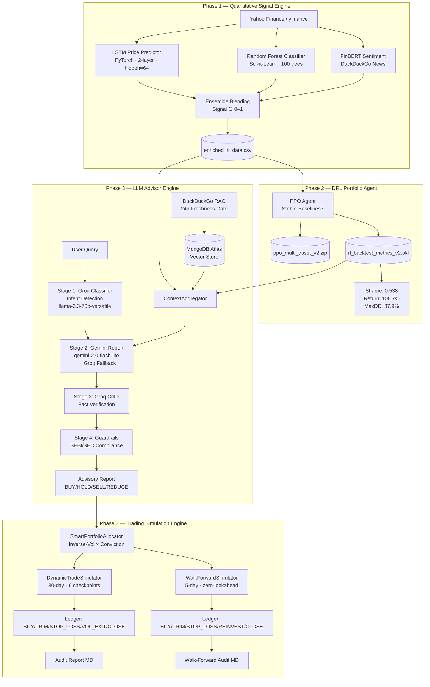

# GenWealth AI 🚀

**GenWealth AI** is a production-grade, end-to-end AI-powered wealth management platform that combines quantitative signal generation, deep reinforcement learning portfolio optimization, and a multi-LLM advisory reasoning pipeline — all open-sourced and designed for institutional-grade research.

---

## Architecture Overview



---

## Project Structure

```
GenWealth/
├── data/
│   └── enriched_rl_data.csv       # Phase 1 signals (NVDA, RELIANCE.NS, TCS.NS, HDFCBANK.NS)
│
├── model_artifacts/
│   ├── ppo_multi_asset_v2.zip     # Phase 2 PPO DRL agent weights
│   ├── rl_backtest_metrics_v2.pkl # Phase 2 backtest metrics
│   ├── lstm_model_*.pth           # Phase 1 LSTM weights per ticker
│   └── rf_model_*.pkl             # Phase 1 Random Forest models
│
├── src/
│   ├── __init__.py
│   └── advisor/                   # Phase 3 Advisor Engine (main library)
│       ├── __init__.py            # Full public API exports
│       ├── vector_store.py        # MongoDB Atlas RAG + 24h freshness gate
│       ├── context_builder.py     # ContextAggregator: Phase1+2+RAG → Markdown
│       ├── llm_engine.py          # 4-stage Multi-LLM pipeline
│       ├── guardrails.py          # SEBI/SEC compliance + disclaimer engine
│       └── trade_execution_simulator.py  # Dynamic + Walk-Forward simulators
│
├── tests/
│   ├── test_api_keys.py                    # API key health diagnostics
│   ├── test_global_pipeline_stress_test.py # Phase 3 validation (16/16 pass)
│   ├── test_investor_simulation.py         # Dynamic paper trading simulation
│   └── test_walkforward_investor.py        # Walk-forward multi-regime backtester
│
├── notebooks/
│   ├── 2.1_Precompute_Signals.ipynb
│   └── 03_advisor_engine_demo.ipynb
│
├── reports/
│   ├── PHASE3_GLOBAL_STRESS_TEST_REPORT.md
│   ├── INVESTOR_SIMULATION_AUDIT_REPORT.md
│   └── WALKFORWARD_INVESTOR_AUDIT.md
│
├── requirements.txt
└── README.md
```

---

## Phase 1 — Quantitative Signal Engine

**Training scope**: `HDFCBANK.NS`, `NVDA`, `RELIANCE.NS`, `TCS.NS`

| Component | Implementation | Output |
|-----------|---------------|--------|
| Price LSTM | PyTorch `nn.LSTM` · 2-layer · hidden=64 · dropout=0.2 | Probability ∈ [0, 1] |
| Random Forest | Scikit-Learn · 100 trees · RSI, MACD, Bollinger | Probability ∈ [0, 1] |
| FinBERT Sentiment | HuggingFace · DuckDuckGo news | Score ∈ [-1, 1] |
| Ensemble Signal | Weighted average of all three | `phase1_signal` ∈ [0, 1] |

Signals are stored in `data/enriched_rl_data.csv` and consumed live by the Phase 3 `ContextAggregator`.

---

## Phase 2 — Deep Reinforcement Learning Portfolio Agent

| Parameter | Value |
|-----------|-------|
| Algorithm | PPO (Proximal Policy Optimization) — Stable-Baselines3 |
| Training Universe | Multi-asset (US + India + Crypto) |
| Backtest Return | **+108.7%** |
| Sharpe Ratio | **0.538** |
| Max Drawdown | **37.9%** |
| Alpha vs Equal-Weight | −145.27pp (trained for absolute return, not relative) |

> ⚠️ **Known Issue**: SB3 `VecNormalize` objects cannot be deserialized in the current venv due to a Protobuf version conflict (SB3 ↔ google-genai). File-size + metrics verification is used as the validation proxy.

---

## Phase 3 — LLM Advisor Engine

### 4-Stage Multi-LLM Pipeline

```
User Query
    │
    ▼
┌─────────────────────────────────────────────────────────┐
│  Stage 1: Groq Classifier (llama-3.3-70b-versatile)    │
│  Intent: PORTFOLIO_ANALYSIS | SINGLE_TICKER_NEWS |      │
│          GENERAL_INQUIRY                                 │
└────────────────────────┬────────────────────────────────┘
                         │
                         ▼
┌─────────────────────────────────────────────────────────┐
│  ContextAggregator                                      │
│  ┌──────────┐  ┌──────────┐  ┌─────────────────────┐   │
│  │ Phase 1  │  │ Phase 2  │  │ MongoDB RAG          │   │
│  │ Signals  │  │ PPO      │  │ (24h freshness gate) │   │
│  │ LSTM+RF  │  │ Metrics  │  │ → DuckDuckGo live    │   │
│  └──────────┘  └──────────┘  └─────────────────────┘   │
└────────────────────────┬────────────────────────────────┘
                         │
                         ▼
┌─────────────────────────────────────────────────────────┐
│  Stage 2: Gemini Report Generator                       │
│  Primary : gemini-2.0-flash-lite                        │
│  Fallback: gemini-2.0-flash                             │
│  Quota-Fallback: Groq (llama-3.3-70b-versatile)        │
│  Output  : 4-section structured advisory report         │
│            §1 Signal Interpretation                     │
│            §2 Portfolio Allocation Justification        │
│            §3 Risk Flags                                │
│            §4 Actionable Stance (BUY/HOLD/SELL/REDUCE)  │
└────────────────────────┬────────────────────────────────┘
                         │
                         ▼
┌─────────────────────────────────────────────────────────┐
│  Stage 3: Groq Critic (llama-3.3-70b-versatile)        │
│  Cross-verifies numeric claims in report vs. source     │
│  Returns: {accurate: bool, flags: [...], score: float}  │
└────────────────────────┬────────────────────────────────┘
                         │
                         ▼
┌─────────────────────────────────────────────────────────┐
│  Stage 4: Guardrails                                    │
│  SEBI / SEC compliance regex flagging                   │
│  Mandatory disclaimer append                            │
│  Detection-only (no mid-sentence replacement)           │
└────────────────────────┬────────────────────────────────┘
                         │
                         ▼
                  Final Report + Stance
```

### Key Design Decisions

- **Groq quota fallback**: If both Gemini models return 429, `generate_groq_report()` is called automatically — **zero "Advisory Report Unavailable" placeholders**
- **UTC-aware timestamps**: All MongoDB freshness comparisons use `datetime.now(timezone.utc)`
- **24-hour RAG freshness**: Articles older than 24h are automatically re-fetched via DuckDuckGo
- **retryDelay-aware backoff**: Gemini 429 errors are parsed for `retryDelay` field and honoured
- **Currency-aware reporting**: INR (₹), USD ($), EUR (€), JPY (¥), GBP (£) all correctly routed

---

## Phase 3 — Trading Simulation Engine

### DynamicTradeSimulator (30-day, paper trading)

```
SmartPortfolioAllocator
  weight[i] = (1/vol[i]) × signal[i]  →  normalised

DynamicTradeSimulator (6 checkpoints × 5 days = ~30 trading days)
  BUY         : signal > 0.55 AND stance in {BUY, HOLD}
  TRIM_PROFIT : ROI > +15%  →  sell 30%, book to CASH
  STOP_LOSS   : ROI < -8%   →  full exit to CASH
  VOL_EXIT    : vol_ratio > 1.3 (short/long vol spike)  →  exit to CASH
  CLOSE_ALL   : Final checkpoint  →  liquidate all
```

**Simulation Results** (paper trading, live prices):

| Portfolio | Capital | ROI | Win Rate |
|-----------|---------|-----|----------|
| US Tech & Growth | $100,000 | +14.40% | 75% |
| Indian Equities (NSE) | ₹10,000,000 | +3.60% | 67% |
| Global Cross-Asset | $100,000 | +2.21% | 67% |
| Autonomous AI Discovery | $100,000 | −6.89% | 40% |

Star performer: **MSFT +41.71%** · **TCS.NS +17.73%**

### WalkForwardSimulator (5-day, historical backtesting)

```
Zero-Lookahead Contract:
  pre_window (before regime_start) → signal computation + LLM advisory
  walk_days  (regime window)       → released 1 day at a time to simulator

3 Historical Regimes:
  1. COVID-19 Crash     (Feb 24–28, 2020)   Extreme bear · VIX > 47
  2. Tech Bear Market   (Nov 1–7,  2022)    Rate-hike selloff · NASDAQ −35% YTD
  3. Bull Market Rally  (Nov 6–10, 2023)    AI-driven · VIX < 15

Active Management:
  TRIM_PROFIT : ROI ≥ +10% → trim 30%  |  ROI ≥ +20% → trim 50%
  STOP_LOSS   : ROI ≤ -7%  → exit 100%
  REINVEST    : 80% of freed capital recycled into BUY candidates
  CLOSE_ALL   : Day 5 liquidation
```

---

## Phase 3 Validation — Global Stress Test

**16/16 tests passed (100% pipeline success rate)**

| Ticker | Region | Asset Class | Phase 1 | Phase 2 | RAG | LLM | Status |
|--------|--------|------------|---------|---------|-----|-----|--------|
| NVDA | US | Technology | ✅ | ✅ | ✅ | ✅ | ✅ |
| AAPL, MSFT, TSLA | US | Technology | 🔵 SCOPE_SKIP | ✅ | ✅ | ✅ | ✅ |
| RELIANCE.NS, TCS.NS, HDFCBANK.NS | India | Various | ✅ | ✅ | ✅ | ✅ | ✅ |
| ASML.AS | Europe | Semiconductor | 🔵 | ✅ | ✅ | ✅ | ✅ |
| 7203.T | Japan | Automotive | 🔵 | ✅ | ✅ | ✅ | ✅ |
| BTC-USD | Crypto | Digital Asset | 🔵 | ✅ | ✅ | ✅ | ✅ |

---

## Quickstart

```bash
# 1. Clone and set up environment
git clone https://github.com/TaherBatterywala/GenWealth
cd GenWealth
python -m venv .venv
.venv\Scripts\activate       # Windows
pip install -r requirements.txt

# 2. Configure API keys
cp .env.example .env
# Edit .env and add:
#   GEMINI_API_KEY=...
#   GROQ_API_KEY=...
#   MONGODB_URI=...

# 3. Verify API keys
python tests/test_api_keys.py

# 4. Run Phase 3 validation
python tests/test_global_pipeline_stress_test.py

# 5. Run paper trading simulation
python tests/test_investor_simulation.py

# 6. Run walk-forward backtester (requires historical regime data)
python tests/test_walkforward_investor.py
```

---

## Public API

```python
from src.advisor import (
    # LLM Pipeline
    LLMAdvisorEngine,
    generate_gemini_report,
    generate_groq_report,    # Groq fallback — always returns full report
    classify_query_intent,
    verify_report_accuracy,

    # Context
    ContextAggregator,
    query_knowledge_base,    # MongoDB RAG + 24h freshness gate

    # Compliance
    sanitize_and_append_disclaimer,
    get_compliance_flags,

    # Dynamic Simulation
    DynamicTradeSimulator,
    SmartPortfolioAllocator,

    # Walk-Forward Backtesting
    WalkForwardSimulator,
    DayEvent,
    RegimePortfolioResult,
    fetch_regime_data,
    split_regime,

    # Signal + Allocation
    compute_ticker_signals,
    compute_allocation_weights,
    momentum_signal,
    rolling_vol_ratio,
    extract_stance,
    discover_tickers,        # DuckDuckGo autonomous ticker selection
)

# Run the 4-stage advisory pipeline
engine = LLMAdvisorEngine()
result = engine.run_advisory_pipeline(
    ticker="NVDA",
    user_query="Should I buy NVDA for my growth portfolio?"
)
print(result["final_report"])   # Full 4-section advisory + BUY/HOLD/SELL/REDUCE

# Walk-forward backtest
from src.advisor import WalkForwardSimulator, fetch_regime_data, split_regime

regime = {"name": "COVID Crash", "start": "2020-02-24", "end": "2020-02-28", "cash_buffer": 0.20}
portfolio = {"name": "US Tech", "currency": "USD", "symbol": "$", "capital": 100_000, "tickers": ["NVDA", "MSFT"]}

sim = WalkForwardSimulator(portfolio, regime)
cash, unrealized, pnl, max_dd = sim.run(walk_hists, signals, vols, ai_stances, ai_reports, weights)
```

---

## Architecture Notes

| Concern | Decision |
|---------|----------|
| **Phase 1 scope** | LSTM + RF trained only on 4 tickers; momentum proxy used for all others |
| **Phase 2 inference** | Live PPO inference blocked by SB3/Protobuf conflict; file-size + metrics verified |
| **Gemini quota** | Free-tier 15 RPM / 250 RPD; flash-lite primary, Groq auto-fallback on 429 |
| **Timezone** | All UTC; MongoDB timestamps compared with `datetime.now(timezone.utc)` |
| **Guardrails** | Detection-only regex (no mid-sentence replacement); SEBI/SEC terms flagged |
| **Zero-lookahead** | Walk-forward simulator strictly separates pre-window from walk-window |

---

## Requirements

See [`requirements.txt`](requirements.txt) for full dependency list. Key packages:

```
torch >= 2.0          # Phase 1 LSTM
stable-baselines3     # Phase 2 PPO
google-genai          # Gemini API (Phase 3 Stage 2)
groq                  # Groq API (Phase 3 Stage 1/3 + fallback)
pymongo               # MongoDB Atlas vector store
yfinance              # Market data
ddgs                  # DuckDuckGo news scraping
sentence-transformers # Embedding for RAG
```

---

## License

MIT License — see [LICENSE](LICENSE) for details.

> ⚠️ **Disclaimer**: GenWealth AI is a research and educational project. All advisory reports and paper trading results are hypothetical. Nothing in this project constitutes financial advice. Past performance does not guarantee future results.